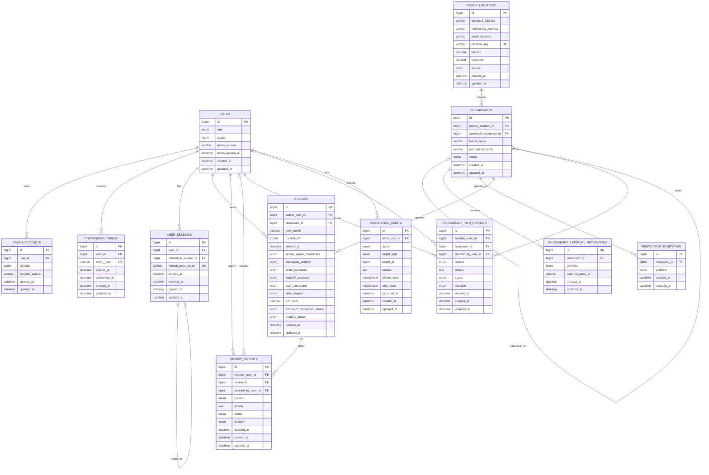

# Rider Voice 데이터베이스 ERD와 테이블 설계

## 1. 문서 목적과 기준

이 문서는 Rider Voice의 현재 JPA Entity와 로컬 MySQL 스키마를 기준으로 각 테이블의 역할, 관계, 제약과 설계 이유를 설명한다. 목표 설계나 향후 계획이 아니라 현재 애플리케이션에서 사용하는 13개 테이블을 대상으로 한다.

- 기준 DB: MySQL 9.3 `rider`
- 기준 ORM: Spring Data JPA와 Hibernate
- 로컬·통합 테스트 schema 반영: `ddl-auto=update`
- 운영 profile schema 자동 생성: 비활성화
- 확인 기준일: 2026-07-28

공개 집계는 별도 집계 테이블에 저장하지 않는다. 초기 MVP에서는 유효한 활성 리뷰를 조회한 뒤 application 계층에서 브랜드 집계와 픽업 장소 집계를 계산한다.

## 2. 공통 스키마와 연관관계 원칙

모든 Entity는 `BaseEntity`를 상속하고 다음 공통 컬럼을 가진다.

| 컬럼 | 타입 | 역할 |
| --- | --- | --- |
| `id` | `BIGINT` | MySQL `AUTO_INCREMENT`로 생성되는 기본 키 |
| `created_at` | `DATETIME(6)` | 최초 생성 시각, UTC 저장 |
| `updated_at` | `DATETIME(6)` | 마지막 수정 시각, UTC 저장 |

JPA 연관관계는 필요한 자식에서 부모로 향하는 단방향 관계만 사용한다.

- 모든 `@ManyToOne`과 `@OneToOne`은 `LAZY` 로딩이다.
- Entity에 편의 목적의 `@OneToMany` 또는 `@ManyToMany` 컬렉션을 두지 않는다.
- 부모에서 자식이 필요하면 repository query로 조회한다.
- FK 삭제 규칙은 `NO ACTION` 또는 `RESTRICT`이며 cascade delete를 사용하지 않는다.
- 리뷰는 soft delete하며 다른 hard delete가 필요한 경우 application service가 소유권, 상태와 참조 관계를 먼저 검증한다.

이 방식은 큰 객체 그래프의 암묵적 로딩, 의도하지 않은 cascade 변경과 기능 경계 사이의 강한 결합을 줄인다.

## 3. 전체 ERD

아래 ERD의 실선은 현재 MySQL에 존재하는 물리적 FK를 의미한다. 도식 안에서는 식별하기 쉽도록 테이블명을 대문자로 표시했으며 실제 물리적 이름은 각 절 제목에 적힌 소문자 이름이다. `moderation_audits.target_id`처럼 논리적으로만 대상을 참조하는 컬럼은 관계선으로 표시하지 않는다.



## 4. 인증과 사용자 테이블

### 4.1 `users`

#### 역할

Rider Voice 내부 계정의 기준 테이블이다. 카카오 계정 자체가 아니라 서비스가 권한과 상태를 관리하는 사용자를 표현한다.

#### 주요 컬럼

- `role`: `USER`, `ADMIN`
- `status`: `PENDING_TERMS`, `ACTIVE`, `SUSPENDED`, `RATE_LIMITED`, `WITHDRAWN`
- `terms_version`: 동의한 필수 약관 버전
- `terms_agreed_at`: 약관 동의 시각

#### 관계

- 하나의 사용자는 여러 OAuth 계정, onboarding token과 service session을 가질 수 있다.
- 사용자는 여러 리뷰와 신고를 작성할 수 있다.
- 관리자는 신고를 결정하고 감사 기록의 행위자가 될 수 있다.

#### 설계 이유

외부 OAuth provider의 계정과 서비스 사용자를 분리해야 사용자 상태, 약관 동의와 `USER`/`ADMIN` 권한을 Rider Voice가 독립적으로 통제할 수 있다. 카카오 로그인이 성공해도 사용자가 활성 상태라는 의미는 아니므로 계정 상태를 별도로 저장한다.

### 4.2 `oauth_accounts`

#### 역할

외부 OAuth subject를 Rider Voice 사용자와 연결한다. 현재 provider는 `KAKAO`이며 카카오 user info의 `id`만 `provider_subject`로 사용한다.

#### 관계와 제약

- `user_id` → `users.id`
- `(provider, provider_subject)` unique: 같은 카카오 계정의 중복 가입 방지
- `(user_id, provider)` unique: 한 사용자가 같은 provider 계정을 여러 개 연결하지 못하게 방지

#### 설계 이유

외부 식별자를 `users`에 직접 넣지 않으면 provider별 형식이 내부 사용자 모델에 전파되지 않고 향후 다른 provider를 추가할 때도 사용자 테이블을 변경하지 않아도 된다. 카카오 access token은 사용자 확인 후 저장하지 않는다.

### 4.3 `onboarding_tokens`

#### 역할

카카오 로그인은 완료했지만 필수 약관에 동의하지 않은 사용자에게 발급하는 5분짜리 임시 자격을 관리한다.

#### 주요 컬럼과 관계

- `user_id` → `users.id`
- `token_hash` unique: 원본 token 대신 hash 저장
- `expires_at`: 사용 가능 만료 시각
- `consumed_at`: 약관 동의에 사용된 시각
- `(consumed_at, expires_at)` index: 사용 가능한 token 조회

#### 설계 이유

약관 미동의 사용자에게 일반 access token을 발급하지 않으면서 OAuth 완료 상태를 짧게 이어갈 수 있다. token 원문을 저장하지 않고 사용 완료 시각을 남겨 재사용을 방지한다.

### 4.4 `user_sessions`

#### 역할

Rider Voice refresh token의 만료, 폐기와 회전을 관리하는 service session 테이블이다.

#### 주요 컬럼과 관계

- `user_id` → `users.id`
- `refresh_token_hash` unique: refresh token 원문 대신 hash 저장
- `expires_at`: session 만료 시각
- `revoked_at`: 로그아웃 또는 회전으로 폐기된 시각
- `rotated_to_session_id` → `user_sessions.id`, unique: 다음 session으로 이어지는 자기참조 1:1 관계

#### 설계 이유

OAuth provider token과 Rider Voice API session을 분리하고 refresh token 탈취나 재사용에 대응하기 위해 서버가 session을 직접 폐기하고 회전 이력을 추적한다. access token 인증 시에는 session 정보뿐 아니라 현재 `users.role`과 상태도 확인한다.

## 5. 음식점 테이블

### 5.1 `pickup_locations`

#### 역할

실제로 음식을 받는 물리적 픽업 장소를 표현한다. 소비자에게 보이는 배달 브랜드와는 별개의 개념이다.

#### 주요 컬럼과 제약

- `standard_address`: provider가 확인한 표준 주소
- `normalized_address`: 검색과 비교에 사용하는 정규화 주소
- `detail_address`: 층, 호수, 픽업 입구 등 선택 상세 위치
- `latitude`, `longitude`: 검증된 좌표
- `source`: `KAKAO`, `MANUAL_ADDRESS`, `ADMIN_CORRECTION`
- `location_key` unique: 정규화 주소와 상세 위치로 만든 장소 중복 방지 키
- `normalized_address` index: 주소 기반 후보 조회

#### 관계

하나의 픽업 장소에 여러 `restaurants`가 연결될 수 있다.

#### 설계 이유

한 주방이나 사업장에서 여러 배달 브랜드를 운영할 수 있으므로 실제 장소와 소비자 노출 브랜드를 같은 row로 표현하면 장소 단위 정보와 브랜드 단위 정보를 구분할 수 없다. 장소를 분리하면 장소 청결·직원 응대·라이더 존중 집계를 여러 브랜드 사이에서 작성자 중복을 제거해 계산할 수 있다.

### 5.2 `restaurants`

#### 역할

소비자와 배달 플랫폼에 표시되는 배달 브랜드를 표현한다.

#### 주요 컬럼과 제약

- `pickup_location_id` → `pickup_locations.id`
- `brand_name`: 공개 표시 이름
- `normalized_name`: 검색과 중복 확인용 정규화 이름
- `status`: `ACTIVE`, `CLOSED`, `MERGED`
- `canonical_restaurant_id` → `restaurants.id`: 중복 병합 시 대표 음식점
- `(pickup_location_id, normalized_name)` unique: 같은 장소의 같은 브랜드 중복 방지
- `(status, normalized_name)` index: 공개 검색

#### 관계

- 하나의 음식점은 하나의 픽업 장소에 속한다.
- 하나의 음식점은 여러 외부 참조, 플랫폼 정보, 리뷰와 음식점 정보 신고를 가질 수 있다.
- 여러 `MERGED` 음식점이 하나의 canonical 음식점을 참조할 수 있다.

#### 설계 이유

배달 브랜드를 장소와 분리해 카카오 지도에 없는 가상 브랜드와 한 장소의 여러 브랜드를 지원한다. 중복 음식점은 hard delete하지 않고 canonical 연결을 유지해 기존 URL, 리뷰와 신고 이력을 잃지 않는다. `CLOSED` 음식점도 기존 리뷰 조회를 유지하기 위해 row를 삭제하지 않는다.

### 5.3 `restaurant_external_references`

#### 역할

내부 음식점과 카카오 같은 외부 장소 provider의 식별자를 연결한다.

#### 주요 컬럼과 제약

- `restaurant_id` → `restaurants.id`
- `provider`: 현재 `KAKAO`
- `external_place_id`: 카카오 장소 ID
- `(provider, external_place_id)` unique: 같은 외부 장소가 여러 내부 음식점에 중복 연결되는 것을 방지

#### 설계 이유

provider 식별자를 `restaurants`에 직접 넣으면 provider가 늘어날 때마다 음식점 schema가 변경된다. 별도 테이블은 외부 식별 체계를 내부 브랜드 모델에서 분리하고 provider별 참조를 독립적으로 관리하게 한다.

### 5.4 `restaurant_platforms`

#### 역할

음식점이 표시되는 배달 플랫폼을 선택 메타데이터로 저장한다.

#### 주요 컬럼과 관계

- `restaurant_id` → `restaurants.id`
- `platform`: `BAEMIN`, `COUPANG_EATS`, `YOGIYO`, `OTHER`
- `restaurant_id` index: 음식점별 플랫폼 조회

#### 설계 이유

한 음식점이 여러 플랫폼에 노출될 수 있으므로 반복 가능한 값을 별도 row로 관리한다. 플랫폼 정보는 음식점 동일성, 실제 운영 주체 또는 방문 사실의 증거로 사용하지 않는다.

## 6. 리뷰 테이블

### 6.1 `reviews`

#### 역할

라이더가 제출한 리뷰 내용과 활성·삭제 상태를 시간순으로 저장한다. 삭제·전체 제외 후 90일이 지나 다시 작성해도 이전 row를 덮어쓰지 않는다.

#### 주요 컬럼

- `author_user_id` → `users.id`
- `restaurant_id` → `restaurants.id`
- `visit_month`: `Asia/Seoul` 기준 현재 또는 직전 방문 연월
- `current_slot`: 활성 리뷰는 `1`, 삭제·전체 제외·병합 이력은 `null`
- `deleted_at`: 사용자 삭제 시각, 활성 리뷰는 `null`
- 6개 평가: 픽업 공간 청결, 포장 안정성, 주문 준비 상태, 전달 정확성, 직원 응대, 라이더 존중
- 각 평가 값: `VERY_GOOD`, `GOOD`, `NEEDS_IMPROVEMENT`, `MAJOR_IMPROVEMENT`, `NOT_OBSERVED`
- `comment`: trim 후 최대 200자의 선택 의견
- `comment_moderation_status`: `NONE`, `PENDING`, `PUBLISHED`, `REJECTED`, `HIDDEN_REPORTED`
- `visibility_status`: `ACTIVE`, `EXCLUDED`

#### 주요 인덱스

- `(author_user_id, restaurant_id, current_slot)` unique: 라이더·음식점별 활성 리뷰 하나
- `(author_user_id, restaurant_id, created_at, id)`: 마지막 제출 조회
- `(restaurant_id, current_slot, visibility_status, deleted_at, created_at, id)`: 공개 리뷰 cursor 조회

#### 관계

- 한 사용자는 여러 리뷰를 작성할 수 있다.
- 한 음식점은 여러 리뷰를 받을 수 있다.
- 한 리뷰는 여러 신고의 대상이 될 수 있다.
- 활성 리뷰는 `current_slot=1`, 미삭제, `ACTIVE` 조건을 모두 만족한다.

#### 설계 이유

활성 리뷰가 있으면 경과 시간과 관계없이 추가 작성을 막는다. 삭제·전체 제외 후에는 모든 상태를 `reviews`에서 조회해 마지막 제출의 `created_at + 90일`을 적용한다. nullable `current_slot` unique 제약은 내부 이력을 보존하면서 동시 요청에도 활성 리뷰 하나를 보장한다. 구조화 평가는 즉시 공개할 수 있지만 자유 의견은 별도 검수 상태를 가져 공개 범위를 독립적으로 통제한다.

## 7. 신고와 관리자 처리 테이블

### 7.1 `review_reports`

#### 역할

사용자가 공개 리뷰를 신고한 기록과 관리자의 처리 결과를 저장한다.

#### 주요 컬럼과 제약

- `reporter_user_id` → `users.id`
- `review_id` → `reviews.id`
- `decided_by_user_id` → `users.id`, nullable
- `reason`: 개인정보, 욕설, 허위 정보, 무관한 내용, 도배 등 신고 사유
- `details`: 선택 상세 내용
- `status`: `PENDING`, `RESOLVED`
- `decision`: `DISMISS`, `HIDE_COMMENT`, `EXCLUDE_REVIEW`
- `decided_at`: 관리자 결정 시각
- `(reporter_user_id, review_id)` unique: 한 사용자의 동일 리뷰 중복 신고 방지

#### 설계 이유

신고 접수와 최종 조치를 리뷰 row에 직접 덮어쓰지 않고 독립된 업무 기록으로 남긴다. 이를 통해 신고자, 사유, 처리 관리자와 결과를 추적하고 동일 대상의 여러 신고를 각각 처리할 수 있다.

### 7.2 `restaurant_info_reports`

#### 역할

음식점 이름, 픽업 장소, 중복, 폐업 등 음식점 정보 오류 신고와 처리 결과를 저장한다.

#### 주요 컬럼과 제약

- `reporter_user_id` → `users.id`
- `restaurant_id` → `restaurants.id`
- `decided_by_user_id` → `users.id`, nullable
- `reason`: `CLOSED`, `DUPLICATE`, `INCORRECT_NAME`, `INCORRECT_PICKUP_LOCATION`, `OTHER`
- `status`: `PENDING`, `RESOLVED`
- `decision`: `DISMISS`, `RESOLVE`
- `(reporter_user_id, restaurant_id)` unique: 한 사용자의 동일 음식점 중복 신고 방지

#### 설계 이유

음식점 정보 정정은 이름 변경, 장소 재연결, 병합, 폐업처럼 서로 다른 변경을 유발한다. 신고를 별도 Entity로 두면 접수 상태와 실제 정정을 하나의 application 트랜잭션에서 처리하면서 원래 신고 내용도 보존할 수 있다.

### 7.3 `moderation_audits`

#### 역할

관리자 검수, 신고 결정과 음식점 정정의 변경 전후 상태를 저장하는 감사 로그다.

#### 주요 컬럼과 관계

- `actor_user_id` → `users.id`: 작업한 관리자
- `action`: 의견 승인·거절, 리뷰 제외, 음식점 이름 변경, 장소 재연결, 병합, 폐업·재개장 등의 작업
- `target_type`: `REVIEW`, `REVIEW_REPORT`, `RESTAURANT`, `RESTAURANT_INFO_REPORT`
- `target_id`: 대상 ID
- `reason`: 관리자 판단 사유
- `before_state`, `after_state`: 변경 전후 snapshot
- `occurred_at`: 실제 작업 발생 시각
- `(target_type, target_id, created_at, id)` index: 대상별 감사 이력 cursor 조회

#### 설계 이유

관리자 결정은 공개 정보와 집계 결과에 영향을 주므로 누가, 언제, 어떤 이유로 무엇을 변경했는지 추적할 수 있어야 한다. 여러 종류의 대상을 하나의 감사 테이블에서 기록하기 위해 `target_type + target_id` 논리 참조를 사용한다.

`target_id`에는 물리적 FK를 두지 않는다. 하나의 컬럼이 여러 테이블을 참조하는 다형적 관계를 일반 FK 하나로 표현할 수 없고, 대상이 병합되거나 상태가 바뀐 뒤에도 감사 기록 자체는 유지해야 하기 때문이다.

## 8. 핵심 데이터 흐름

### 8.1 카카오 로그인과 약관 동의

```text
카카오 user info의 id
  → oauth_accounts에서 내부 사용자 조회
  → users의 상태와 약관 동의 확인
  → 미동의: onboarding_tokens 발급
  → 동의 완료: user_sessions와 service token 발급
```

### 8.2 음식점 등록과 첫 리뷰

```text
카카오 장소 또는 검증 주소
  → pickup_locations 조회 또는 생성
  → restaurants 조회 또는 생성
  → external reference / platform metadata 저장
  → reviews 생성
```

provider 검증은 DB 트랜잭션 전에 수행한다. 검증된 픽업 장소·브랜드 등록과 첫 리뷰 저장은 같은 application use case와 트랜잭션에서 함께 성공하거나 실패한다.

### 8.3 재작성과 공개 집계

```text
reviews에서 활성 리뷰와 마지막 제출 조회
  → 활성 리뷰가 있으면 새 작성 거부
  → 활성 리뷰가 없으면 마지막 created_at 기준 90일 검증
  → current_slot=1인 새 reviews row 생성
  → 활성 리뷰를 조회해 공개 집계 계산
```

브랜드 집계는 라이더별 해당 브랜드의 활성 리뷰 하나를 사용한다. 픽업 장소 집계는 같은 라이더가 한 장소의 여러 브랜드에 활성 리뷰를 남겼더라도 가장 최근 리뷰 하나만 사용한다. 집계는 서로 다른 유효 라이더 5명부터 공개한다.

### 8.4 신고와 관리자 처리

```text
리뷰 신고 또는 음식점 정보 신고
  → report row 생성
  → 관리자가 대상과 활동 정보를 조사
  → 신고 결정과 실제 상태 변경
  → moderation_audits에 변경 전후 기록
```

의견 위반은 의견만 비공개 처리하고 구조화 평가는 유지한다. 허위·도배로 판단된 리뷰는 전체를 `EXCLUDED`로 전환한다. 음식점 정보 신고 승인은 실제 정정, 신고 종결과 감사 기록을 하나의 트랜잭션으로 처리한다.

## 9. 주요 무결성 규칙

| 규칙 | 보장 위치 |
| --- | --- |
| 외부 OAuth 계정 중복 방지 | `oauth_accounts(provider, provider_subject)` unique |
| 동일 장소 중복 방지 | `pickup_locations.location_key` unique |
| 같은 장소의 같은 브랜드 중복 방지 | `restaurants(pickup_location_id, normalized_name)` unique |
| 같은 외부 장소 중복 연결 방지 | `restaurant_external_references(provider, external_place_id)` unique |
| 라이더·음식점별 활성 리뷰 하나 | `reviews(author_user_id, restaurant_id, current_slot)` unique |
| 동일 사용자의 같은 리뷰 중복 신고 방지 | `review_reports(reporter_user_id, review_id)` unique |
| 동일 사용자의 같은 음식점 중복 신고 방지 | `restaurant_info_reports(reporter_user_id, restaurant_id)` unique |
| refresh token 원문 비저장과 중복 방지 | `user_sessions.refresh_token_hash` unique |
| 부모 삭제에 따른 이력 유실 방지 | 모든 FK `NO ACTION`/`RESTRICT` |
| 활성 리뷰와 90일 제한 직렬화 | nullable current slot unique와 application transaction retry |

DB unique와 FK는 동시 요청에서도 최소 무결성을 보장한다. 방문 연월, 활성 리뷰 존재, 90일 제한, 리뷰 소유권, 상태 전이와 관리자 결정 같은 비즈니스 규칙은 application service와 domain policy에서 검증한다.

## 10. 최종 정리

Rider Voice의 데이터 모델은 서로 다른 책임을 하나의 테이블에 섞지 않는 것을 핵심 원칙으로 한다.

1. `users`와 `oauth_accounts`를 분리해 외부 카카오 식별자와 내부 권한·상태를 독립적으로 관리한다.
2. `pickup_locations`와 `restaurants`를 분리해 실제 픽업 장소와 소비자에게 보이는 배달 브랜드를 구분한다.
3. `restaurant_external_references`와 `restaurant_platforms`를 분리해 외부 provider와 플랫폼 메타데이터가 핵심 음식점 모델을 오염시키지 않게 한다.
4. `reviews`의 soft delete와 nullable current slot으로 활성 리뷰 하나, 90일 제한과 동시 제출을 관리한다.
5. 신고 테이블과 `moderation_audits`를 분리해 사용자 제보, 관리자 결정, 실제 데이터 변경과 감사 이력을 추적한다.
6. 모든 공개 집계는 별도 점수 테이블 없이 활성 유효 리뷰로 계산하며, 종합 점수·평균 별점·순위·인증 배지를 만들지 않는다.

이 구조에서 카카오 로그인은 계정 식별 수단일 뿐 라이더 신분이나 실제 방문을 증명하지 않는다. 리뷰와 집계의 저장 구조도 이 신뢰 경계를 바꾸지 않으며 모든 공개 리뷰와 리포트는 미인증 정보임을 명시해야 한다.

## 11. 관련 문서

- [PRD](PRD.md): 제품 목표, 사용자 흐름과 신뢰 경계
- [Architecture](ARCHITECTURE.md): 계층 구조, 도메인 정책과 데이터 흐름
- [ADR](ADR.md): 데이터 모델과 기술 결정의 근거
- [API Specification](API_SPEC.md): 공개 API와 DTO 계약
