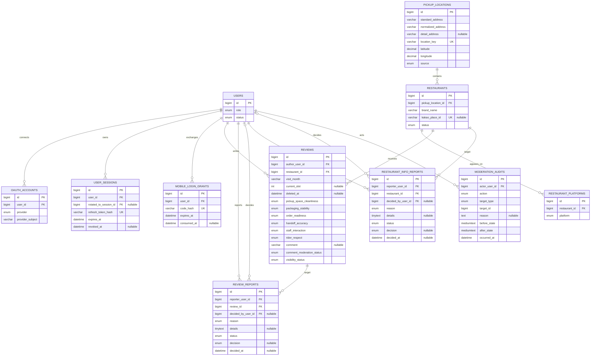

# Rider Voice ERD

## 먼저 보는 데이터 관계

ERD는 서비스가 저장하는 정보와 정보 사이의 관계를 그린 문서입니다. 아래 관계만 먼저 이해하면 뒤의 상세 테이블을 읽기 쉽습니다.

```text
사용자
├── 카카오 계정 연결 정보
├── 로그인 유지 정보
└── 작성한 리뷰
      ├── 배달 브랜드
      │     ├── 실제 픽업 장소
      │     └── 노출되는 배달 플랫폼
      └── 리뷰 신고

배달 브랜드
└── 음식점 정보 신고

관리자 처리
└── 누가 무엇을 변경했는지 남기는 감사 기록
```

예를 들어 `행복공유주방 강남점`은 실제 픽업 장소이고, 그 안에서 운영하는 `강남 떡볶이`는 배달 브랜드입니다. 리뷰는 배달 브랜드에 작성하지만, 청결·직원 응대·라이더 존중 항목은 같은 픽업 장소를 기준으로 모아 계산합니다.

### 주요 정보가 필요한 이유

| 정보 | 저장하는 이유 |
| --- | --- |
| 사용자·카카오 계정 | 같은 작성자를 구분하고 중복 작성 제한을 적용하기 위해서입니다. |
| 로그인 세션 | refresh token을 회전하고 로그아웃된 세션을 다시 사용하지 못하게 하기 위해서입니다. |
| 픽업 장소 | 실제로 음식을 가져가는 장소를 배달 브랜드와 분리하기 위해서입니다. |
| 배달 브랜드 | 소비자가 배달 앱에서 보는 음식점 단위로 리뷰를 찾기 위해서입니다. |
| 리뷰 | 6개 평가, 자유 의견, 방문 연월과 삭제·제외 이력을 보존하기 위해서입니다. |
| 신고·감사 기록 | 신고 처리 결과와 관리자 변경을 나중에 확인하기 위해서입니다. |

### 데이터베이스 용어

| 용어 | 쉬운 설명 |
| --- | --- |
| 테이블 | 같은 종류의 정보를 모아 두는 표입니다. |
| 컬럼 | 표에 저장하는 하나의 정보 항목입니다. |
| 기본 키(`PK`) | 각 기록을 구분하는 고유 번호입니다. |
| 외래 키(`FK`) | 다른 표의 기록과 연결하는 번호입니다. |
| 고유 제약(`UK`, unique) | 같은 값이 중복 저장되지 못하게 하는 규칙입니다. |
| 인덱스 | 자주 찾는 정보를 빠르게 조회하도록 돕는 목록입니다. |
| soft delete | 기록을 실제로 지우지 않고 삭제 시각을 남겨 화면에서만 제외하는 방식입니다. |

뒤의 Mermaid 관계도와 컬럼 설명은 개발·운영 담당자를 위한 기술 참고입니다.

## 1. 기준

Rider Voice의 현재 JPA Entity와 MySQL 8.4.10 기준 11개 도메인 테이블 구조와 주요 관계를 정리합니다. 운영 schema의 최초 기준은 Flyway `V1__create_initial_schema.sql`이며 모바일 로그인 grant는 `V2__create_mobile_login_grants.sql`에서 추가하고 이후 변경도 새 versioned migration으로 반영합니다.

Flyway가 생성하는 `flyway_schema_history`는 migration 적용 이력용 관리 테이블이므로 아래 11개 도메인 테이블 수와 관계도에는 포함하지 않습니다.

모든 테이블은 `BaseEntity`에서 다음 공통 컬럼을 사용한다

| 컬럼 | 타입 | 제약 |
| --- | --- | --- |
| `id` | `BIGINT` | PK, `IDENTITY` |
| `created_at` | `DATETIME(6)` | UTC, not null |
| `updated_at` | `DATETIME(6)` | UTC, not null |

## 2. 테이블 구조




## 3. 테이블별 역할과 주요 제약

| 영역 | 테이블 | 역할 | 주요 unique 제약 |
| --- | --- | --- | --- |
| 인증 | `users` | 내부 사용자 권한과 이용 상태 | - |
| 인증 | `oauth_accounts` | 외부 OAuth 계정 연결 | `(provider, provider_subject)`, `(user_id, provider)` |
| 인증 | `user_sessions` | refresh token 만료·폐기·회전 | `(refresh_token_hash)` |
| 인증 | `mobile_login_grants` | 2분 유효 모바일 OAuth 교환 코드 hash와 일회성 소비 상태 | `(code_hash)` |
| 음식점 | `pickup_locations` | 실제 픽업 장소 | `(location_key)` |
| 음식점 | `restaurants` | 소비자에게 보이는 배달 브랜드 | `(pickup_location_id, brand_name)`, `(kakao_place_id)` |
| 음식점 | `restaurant_platforms` | 배달 플랫폼 메타데이터 | - |
| 리뷰 | `reviews` | 평가, 의견과 공개·삭제 이력 | `(author_user_id, restaurant_id, current_slot)` |
| 운영 | `review_reports` | 리뷰 신고와 처리 결과 | `(reporter_user_id, review_id)` |
| 운영 | `restaurant_info_reports` | 음식점 정보 신고와 처리 결과 | `(reporter_user_id, restaurant_id)` |
| 운영 | `moderation_audits` | 관리자 변경 전후 감사 기록 | - |

## 4. 검색·집계에서 사용하는 현재 데이터 규칙

- 검색 목록의 브랜드별 작성자 수는 `reviews.restaurant_id`를 음식점 ID 집합으로 묶어 한 번에 조회한다.
- 집계에는 `visibility_status=ACTIVE`, `current_slot`이 존재하고 `deleted_at`이 없는 현재 리뷰만 포함한다.
- 브랜드 집계는 작성자를 중복 제거한다. 픽업 장소 집계는 같은 작성자의 여러 브랜드 리뷰 중 생성 시각과 ID가 가장 최근인 리뷰 하나만 사용한다.
- 삭제 또는 전체 제외된 리뷰 행은 이력과 90일·24시간 제한 계산을 위해 남지만 공개 검색과 집계에서는 제외한다.
- 수동 등록은 기존 `pickup_locations`를 재사용하거나 새 행을 만든 뒤 `restaurants`를 연결한다. 음식점과 첫 리뷰는 같은 트랜잭션에서 저장하며 별도 임시 등록 테이블은 사용하지 않는다.
- 이번 검색 배치 조회 변경은 테이블이나 제약을 추가하지 않으므로 Flyway migration이 필요하지 않다.
