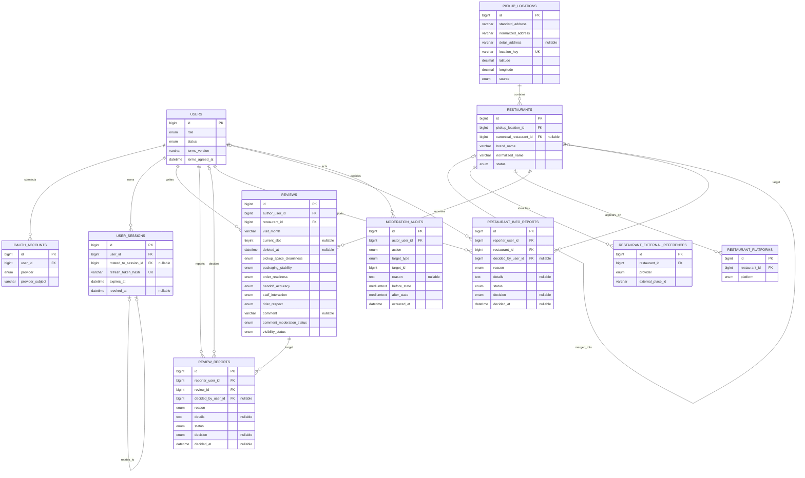

# Rider Voice ERD

## 1. 기준

이 문서는 현재 JPA Entity와 로컬 MySQL schema를 기준으로 Rider Voice의 11개 테이블 구조를 보여준다. 도식에는 관계와 무결성을 이해하는 데 필요한 핵심 컬럼만 표시하며, 정확한 타입과 전체 index는 JPA Entity와 실제 schema를 기준으로 한다.

모든 테이블은 `BaseEntity`에서 다음 공통 컬럼을 사용한다.

| 컬럼 | 타입 | 제약 |
| --- | --- | --- |
| `id` | `BIGINT` | PK, `IDENTITY` |
| `created_at` | `DATETIME(6)` | UTC, not null |
| `updated_at` | `DATETIME(6)` | UTC, not null |

## 2. 테이블 구조

## 3. 테이블별 역할과 주요 제약

| 영역 | 테이블 | 역할 | 주요 unique 제약 |
| --- | --- | --- | --- |
| 인증 | `users` | 내부 사용자 상태와 권한 | - |
| 인증 | `oauth_accounts` | 외부 OAuth 계정 연결 | `(provider, provider_subject)`, `(user_id, provider)` |
| 인증 | `user_sessions` | refresh token 만료·폐기·회전 | `(refresh_token_hash)` |
| 음식점 | `pickup_locations` | 실제 픽업 장소 | `(location_key)` |
| 음식점 | `restaurants` | 소비자에게 보이는 배달 브랜드 | `(pickup_location_id, normalized_name)` |
| 음식점 | `restaurant_external_references` | 외부 장소 ID 연결 | `(provider, external_place_id)` |
| 음식점 | `restaurant_platforms` | 배달 플랫폼 메타데이터 | - |
| 리뷰 | `reviews` | 평가, 의견과 공개·삭제 이력 | `(author_user_id, restaurant_id, current_slot)` |
| 운영 | `review_reports` | 리뷰 신고와 처리 결과 | `(reporter_user_id, review_id)` |
| 운영 | `restaurant_info_reports` | 음식점 정보 신고와 처리 결과 | `(reporter_user_id, restaurant_id)` |
| 운영 | `moderation_audits` | 관리자 변경 전후 감사 기록 | - |

